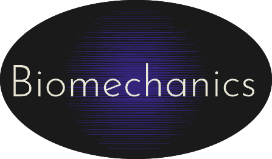
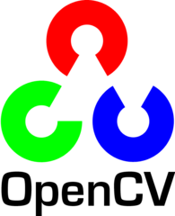

<div id="top"></div>

<!-- PROJECT LOGO -->
<br />
<div align="center">
  
  <p align="center">  
  </p>
  
</div>
<br>
<p align="center"><a href="https://www.python.org/" target="_blank"></a>&nbsp;<a href="https://opencv.org/" target="_blank"></a>&nbsp;<a href="https://github.com/OmSadavarte/Biomechanics-Ai_ntl.ipynb" target="_blank"></a>&nbsp;<a href="https://reactjs.org/" target="_blank"></a>&nbsp;&nbsp;</p>
<hr>

<div align="left"> 
<br>
</div>
<br>
We at Biomechanics-Ai aimed to create a model which deals with Ergonomic assessment using Pose Estimation. We've developed a contemporary model of pose analysing using RULA(Rapid Upper Limb Assessment) and Rapid Office strain Assessment. In the modern IT world muscoskeletal disorders and physio-medical hazards have progressed exponentially, which can be majorly cured by keeping tabs on your stance.<br>
</div>


<br>
<br>


<!-- ABOUT THE PROJECT -->
<div align="left"> 
<br>


- Improving the quality of health of employees by keeping a track of their neck positioning and body stance(standing+sitting).
- Store and display their REBA & RULA assestment scores real-time.
- Create awarness of Ai/ML in the Field of Physiology and MSD healthcare.

<br>
<br>

<div align="left"> 
<br>
</div>
<br>
<p align="left">Our project is a practical representation of Computer Vision in a real-life problem, it makes a starking attempt to 
help the companies and individuals in ergonomics and personal safety.</P>

<br>
<br>

<div align="left"> 

 </div>
 <br>
 
 + Python <a href="https://www.python.org" target="_blank">
</img></a>&nbsp;&nbsp;

+ OpenCV  <a href="https://opencv.org/"></img></a>&nbsp;&nbsp;

+ React  <a href="https://reactjs.org/"></img></a>&nbsp;&nbsp;

+ Mediapipe  <a href="https://dart.dev/"></img></a>&nbsp;&nbsp;


<br>
<br>
<div align="left"> 
<br>


* [Rapid Entire Body Assesment](https://www.researchgate.net/publication/12603778_Rapid_entire_body_assessment_REBA)
* [Posture Thesis](https://www.google.com/url?sa=t&rct=j&q=&esrc=s&source=web&cd=&cad=rja&uact=8&ved=2ahUKEwi3_fWUyKn2AhWJsVYBHRp4DWkQFnoECAMQAQ&url=https%3A%2F%2Fwww.iosrjournals.org%2Fiosr-jspe%2Fpapers%2FVol-5Issue5%2FVersion-1%2FB05050815.pdf&usg=AOvVaw18iFBmKjpRArSuNyW56IcQ)
* [Rapid Upper Limb Assesment](http://ftp.demec.ufpr.br/disciplinas/TM802/RULA_original%201993.pdf)
* [The development of fully automated RULA/REBA  assessment system based on Computer Vision](https://scholar.uwindsor.ca/cgi/viewcontent.cgi?article=9613&context=etd)

<br>

<br>
<div align="left"> 
<br>
</div>
<br>
<strong> Gui image feed --> Pose coordinates --> Angle Calculation --> RULA/REBA algorithm -->Assesment score & Table appending </strong><br>
<br>

<p float="left">
  
   
  
</p>

<p float="left">
  
   
  
</p>
<br>
<br>

<div align="left"> 
   
</div><br>
  
   ```
   git clone https://github.com/<your-username>/Biomechanics-Ai_ntl.ipynb
   ```   

   ```
   cd Biomechanics-Ai_ntl.ipynb
   ```

   ```
   pip install -r requirements.txt
   ```

   ```
   python3 app.py
   ```
<br>
<br>
 
<div align="left"> 
<br>

- Integration with smart camera and iot.
- Creating an ecosystem of devices which can monitor and provide real time alerts about their hazardous muscoskeletal posture.
- Improved Model accuracy.
- Integration with open posture model by CMU.
- Backend data to scripted physio assesment sheet.
- Integrable web tool dev with existing web-app.


<br>
<br>

 <div align="left"> 
   
</div>
  <br>

<div align="left"> 
  <table>
<tr align="left">
 <td>

Divyanshu Yadav

<p align="center">

</p>
<p align="center">
<a href = "https://github.com/divyanshu1810"></a>
<a href = "https://www.linkedin.com/in/divyanshu-yadav-b32a76220/">

</a>
</p>
 <strong>Web Developer<strong>
</td>
<td>

Krish Katyal 

<p align="center">

</p>
<p align="center">
<a href = "https://github.com/krishkatyal"></a>
<a href = "https://www.linkedin.com/in/krishkatyal/">

</a>
</p>
    <strong>ML Developer<strong>
</td>

<td>
  
Omprasad Sadavarte

<p align="center">

</p>
<p align="center">
<a href = "https://github.com/OmSadavarte"></a>
<a href = "https://www.linkedin.com/in/omprasad-sadavarte-3a0bbb211/">

</a>
</p>
  <strong>ML | Frontend<strong>
</td>
  
  </table>
</tr>
</div>
  <br>

 <div align="left">
 <p>
 <br>
   <br>
   <br><strong>Biomechanics-Ai_ntl.ipynb</strong> is under MIT License, Please Read the license.
  <p>
 </div>
 <br>
  
  
 <!-- END -->
